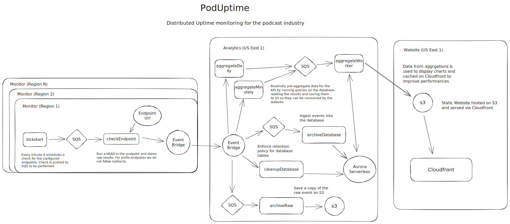

# PodUptime

PodUptime is a distributed uptime monitoring for the podcast industry, developed and maintained by [Spreaker](https://www.spreaker.com). Its purpose is to measure the availability of hosting platforms and track prefixes.

This project originated as a side endeavor, aimed at assisting our Creators Success team in promptly assessing and addressing issues within the podcast industry that might impact our customers. For instance, it helps identify problems such as import procedures failing due to temporary unavailability of an RSS feed or RSS enclosure, or playback issues resulting from tracking prefix glitches.

## Architecture



PodUptime is made of 3 different components: `monitor`, `analytics`, and `website`.

### Monitor

The `monitor` component is responsible for performing the actual measurements and is a multi-region system deployed in three AWS Regions: `us-west-1`, `us-east-2`, and `eu-south-1`. These regions were chosen to avoid those where most companies typically host their workloads, ensuring an unbiased measurement.

The monitoring process starts with a scheduled `Lambda` function that runs every minute and pushes monitoring jobs to an `SQS` queue. Each job corresponds to a URL to be monitored and is executed in isolation by a second `Lambda` that consumes the queue.

Measurement results are sent to a dedicated `EventBridge` bus in the same region. Each `EventBridge` bus is configured with rules to forward the measurements to a centralized `EventBridge` bus belonging to the `analytics` application.

### Analytics

The purpose of the `analytics` component is to store data, manage its lifecycle, and perform aggregations to make this data available to the `website`.

Incoming data from `EventBridge` is consumed by two different `Lambda` functions. Their main goals are to store data in two different storage systems:

- Raw data is stored in `S3` in an `Athena`-friendly location. This ensures the data can be queried and remains available in case there's a need to replay it for ingestion elsewhere at a later stage.
- Measurements are stored in `Aurora Serverless`.

The data aggregation process begins with a scheduled `Lambda` function that runs every minute. It pushes aggregation jobs to an `SQS` queue. These aggregations can be of different types, and each aggregation result is saved as a `JSON` aggregation in `S3`. The `website` application uses these `JSON` aggregations as a data source.

Data retention is managed differently for the two storage systems:

- In `S3`, data retention is implemented with a lifecycle policy.
- In `Aurora Serverless`, data retention is handled by a scheduled `Lambda` that runs daily.

### Website

The primary purpose of the `website` component is to offer a user interface for visualizing the data collected by the `monitor` and `analytics` components. It serves as a static website, constructed with [Astro](https://astro.build) and styled with [Tailwind CSS](https://tailwindcss.com/). Deployment involves hosting the website on `S3` and delivering it via a `CloudFront` distribution. This setup ensures efficient and scalable delivery of the user interface to end-users.

## Technology Choices

At Spreaker, side projects serve as a means to have fun and explore technologies we are not yet familiar with. PodUptime is no exception and embraces a blend of foundational technologies that are part of our standard toolset (`S3`, `Lambda`, `CloudFront`, `Serverless Framework`) alongside technologies we are eager to experiment with and learn more about. Some of these include:

- [EventBridge](https://aws.amazon.com/eventbridge/): Implemented for event fanout.
- [Aurora Serverless v2](https://docs.aws.amazon.com/AmazonRDS/latest/AuroraUserGuide/aurora-serverless-v2.html): Utilized for storing data in a relational database.
- [Github Actions](https://docs.github.com/en/actions): Employed for running automated test suites with every push.
- [node:test](https://nodejs.org/docs/latest-v18.x/api/test.html): A native test runner for Node.js.
- [undici](https://github.com/nodejs/undici): An HTTP client for Node.js.


## Local Development

For local development, we utilize a Docker container. You can initiate this container by executing the following command:

```shell
docker compose build dev && docker compose run --rm dev sh
```

The command also also starts a sidecar container with PostgreSQL. This configuration enables tests to run against a local copy of the database, and the database schema is automatically loaded when the container starts.

### Running tests

Both the `monitor` and `analytics` components include automated tests. These tests run automatically on each pull request (PR) and can also be run manually from within the development container.

To run the tests use the following commands:

```shell
npm run test
```

If you prefer to run the tests in watch mode, allowing them to re-run automatically after each code change, use:

```shell
npm run test-watch
```

### Running website

To interact with the website and experiment with it, the best approach is to run it locally using the `poduptime.com` data and configuration. This method provides an accurate representation of how the website would appear in a production environment.

To run the website development server with the `poduptime.com` data and configuration, follow these steps and the instructions displayed on the console to access the website.

```shell
cd website
npm install
STAGE=prod PUBLIC_STAGE=prod npm run dev -- --host
```

Environment and configuration variables are loaded from `conf/config_${STAGE}.js`. The `STAGE` and `PUBLIC_STAGE` variables determine the environment and configuration to load.

- `STAGE` is used for the website generation part of `Astro`.
- `PUBLIC_STAGE` is used for the website client JavaScript.

These two variables should always be set to the same value to ensure consistent behavior.

### Adding a new Endpoint/Service

Adding a new endpoint or service to an existing endpoint is a straightforward process:

1. Start by adding the endpoint definition in `conf/config_${STAGE}.js`. Each endpoint can contain one or more services to monitor. For prefix services, ensure that the configuration also includes an `expected_url` field, specifying the destination of the redirect.

2. If it's a prefix endpoint, include a new `<item>` in the RSS feed at `website/public/rss/feed.xml`. This step is particularly useful when prefix services need to validate the feed you submit to them for the presence of the actual prefix.

3. Don't forget to add a changelog entry in `website/src/pages/changelog.astro` to document the changes.

## Deployment

Please note that deployment is managed outside of this repository to safeguard Spreaker-specific details and tooling. As a result, the `serverless.yml` files for each project may not run as-is without external parameters. These necessary parameters are declared within the files using the `${param.SOMETHING}` syntax.

This approach ensures that sensitive information and configurations are kept separate from the public repository while still allowing for successful deployments when provided with the required parameters.

## Contributing

Please note that the project is currently in its early stages, and we are actively working on determining design choices to complete the minimum set of features. As a result, at this moment, we are not ready to accept Pull Requests from external contributors.

However, if you encounter any issues with the code or wish to request the addition of a specific service, please don't hesitate to open an issue. We will promptly review and address it to the best of our ability.

We appreciate your understanding and patience as we continue to develop and enhance the project.